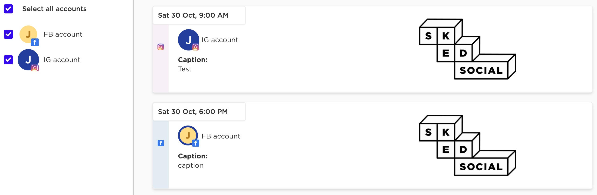
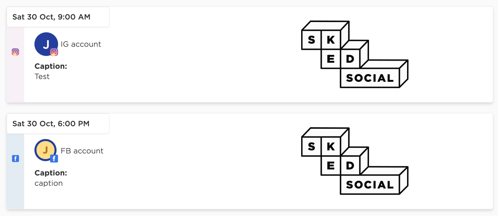

# Sked Coding test

Sked social is an aggregator of social media post system. Here we are going to do simple version of post list page. This coding test is for frontend and fullstack respectively. Please read the following instruction carefully. Expected test could be finished in 1 hour. Welcome to raise any question.

## Installation

```bash
yarn install
or
npm i
```

## How to run

### Client

```bash
yarn run client-dev
```
to launch web client http://localhost:3000

### Server

```bash
yarn run server-dev
```
to launch server http://localhost:3001

You can also see "Hello world" at http://localhost:3001/posts

## How to test

### Client

```bash
yarn run client-test
```
to test all test cases in `/src`

### Server

```bash
yarn run server-test
```
to test all test cases in `/server/tests`


## Frontend test requirement

#### Implement post list page **_with_** social media account filter such as



a) Posts show on the right-hand side. Each post has
- social media account image(with initial), name and icon
- image to publish
- caption
- timestamp on the top-left

b) Social media account filter shows on the left-hand side including
- social media account image, name and icon
- checkbox for individual social media account. When checkbox is checked, corresponding posts are shown on the right-hand side
- Additional "Select all accounts" checkbox to show all posts

c) Test
- Comprehensive unit tests are required
- At least one integration test (or e2e test). You can choose from selenium, cypress or other libraries

d) Post data can be loaded from `/src/controllers/posts.js`

## Fullstack test requirement

#### Server: implement `GET /posts`

a) Api return list of posts

b) Use `/server/src/models/post.model.js` to mock loading posts from db

c) Test
- Unit tests are required
- At least one integration test is required

#### Client: implement post list page but **_without_** account filer such as



a) Posts show on the right-hand side. Each post has
- social media account image(with initial), name and icon
- image to publish
- caption
- timestamp on the top-left

b) Post data should be loaded via `GET /posts` from server

c) At least one unit test is required

## Code structure
- `/src` root of client code
  - `/components` components
  - `/controllers` controllers regarding MVC
  - for tests files, you can put same folder or create another one
- `/server` root of server code
  - `/src/controllers` controllers for routes
  - `/src/services` services
  - `/src/modles` models to access DB
  - `/tests` root of server tests
- `/public` root of public assets

## Worth mentioning
- Image assets are already put into `/public/images`, basically web client can load assets publicly
- It only provides initial for social media account image. You can use background color with "initial" character as image alternative.
- Submitted code should be linted and prettified
- You can add any library for what you need. e.g. `Typescript`, `Material UI`, `Redux` and so on
- (important) Need to think about what else library can improve code structure. That would be discussion in the next round of interview
- Can specify future works if you don't have time for your implementation
